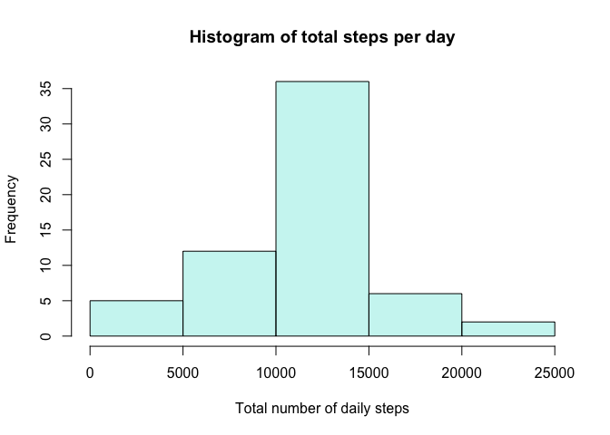

## Loading and preprocessing the data


```r
# clear workspace
rm(list=ls())

# load necessary packages
library(rprojroot)
library(knitr)
library(data.table)
library(tidyverse)
library(lubridate)
library(ggplot2)

# source files within this project
path <- function(x) find_root_file(x, criterion = has_file('RepData_PeerAssessment1.Rproj'))
```


```r
# unzip data file
dataFile <- unzip(path('activity.zip'))

# load data into dataframe
data <- fread(dataFile)
```

## What is mean total number of steps taken per day?


```r
# create a summary dataframe with total steps per day
totalStepsData <- data %>%
  mutate(date = ymd(date)) %>%
  group_by(date) %>%
  summarize(totalSteps = sum(steps, na.rm = TRUE))

# calculate mean steps per day
meanStepsVal <- mean(totalStepsData$totalSteps, na.rm = TRUE)

# calculate median steps per day
medianStepsVal <- median(totalStepsData$totalSteps, na.rm = TRUE)
```

The mean total number of steps taken per day is 9354.23. The median total number of steps per day is 10395. 

A histogram of total steps per day is shown below:


```r
# create histogram of total number of steps per day
hist(totalStepsData$totalSteps,
     col = alpha("turquoise", 0.3),
     xlab = 'Total number of daily steps',
     ylab = 'Frequency',
     main = 'Histogram of total steps per day')
```

<!-- -->

## What is the average daily activity pattern?


```r
# summarize steps per interval, averaged across days
stepsByIntervalData <- data %>%
  group_by(interval) %>%
  summarize(meanSteps = mean(steps, na.rm = TRUE))

# which 5-minute interval contains max number of steps?
maxInterval <- stepsByIntervalData$interval[which.max(stepsByIntervalData$meanSteps)]
```

Interval 835 contains the maximum number of steps, when averaged across all days.

A time series plot of mean steps per 5-minute time interval, averaged across days, is shown below.


```r
ggplot(stepsByIntervalData, aes(x = interval, y = meanSteps)) + 
  geom_line(colour = "turquoise") +
  labs(x = '5-minute time interval',
       y = 'Mean steps across all days',
       title = 'Time series plot of mean steps by interval')
```

<!-- -->

## Imputing missing values


```r
# how many rows in the raw data have missing values?
nMissingDataPoints <- sum(is.na(data$steps))

# create new dataset with missing data filled in,
# fill in missing values with mean for respective 
# 5-minute time interval

# first split the data into missing and non-missing values
data_nonmissing <- data %>%
  filter(!is.na(steps))
data_missing <- data %>%
  filter(is.na(steps))

# in the data with missing values, fill in steps with mean value for the respetive 5-min time interval
data_missing <- data_missing %>%
  select(-steps) %>%
  left_join(stepsByIntervalData, by = c('interval')) %>%
  select(steps = meanSteps, date, interval)

# bind the filled-in data with the nonmissing data
data_new <- rbind(data_nonmissing, data_missing) %>%
  dplyr::arrange(date)

# calculate total steps for each day for new dataset
totalStepsData_new <- data_new %>%
  mutate(date = ymd(date)) %>%
  group_by(date) %>%
  summarize(totalSteps = sum(steps, na.rm = TRUE))

# calculate mean number of steps per day in the new dataset
meanStepsVal_new <- mean(totalStepsData_new$totalSteps, na.rm = TRUE)

# calculate median number of steps per day in the new dataset
medianStepsVal_new <- median(totalStepsData_new$totalSteps, na.rm = TRUE)
```

The raw data has a total of 2304 rows with missing values. After imputing missing data, the mean total steps per day is 1.0766189\times 10^{4}, and then median total steps per day is 1.0766189\times 10^{4}. A histogram of total steps taken each day after imputing missing data is shown below:


```r
# create histogram of total number of steps per day
hist(totalStepsData_new$totalSteps,
     col = alpha("turquoise", 0.3),
     xlab = 'Total number of daily steps',
     ylab = 'Frequency',
     main = 'Histogram of total steps per day')
```

<!-- -->

Imputing missing data changed esimates slightly. After imputing the missing data with the mean steps value for each respective time interval, the mean total steps per day increased slightly, as did the median.

## Are there differences in activity patterns between weekdays and weekends?


```r
weekendDays <- c('Saturday', 'Sunday')

# create a new factor variable indicating whether each day is a weekday or weekend
# create a summary dataframe with total steps per day
dayTypeData <- data_new %>%
  mutate(date = ymd(date),
         day_of_week = weekdays(date),
         day_type = as.factor(if_else(day_of_week %in% weekendDays, 'weekend', 'weekday'))) %>%
  select(-day_of_week) %>%
  group_by(day_type, interval) %>%
  summarize(meanSteps = mean(steps, na.rm = TRUE))

# create a panel plot containing a time series plot for each weekday and weekends, with mean number of steps by time interval
ggplot(dayTypeData, aes(x = interval, y = meanSteps)) +
  geom_line(colour = "turquoise") +
  facet_grid(.~day_type) +
  labs(x = '5-minute time interval',
       y = 'Mean steps across days',
       title = 'Time series plot of mean steps by interval')
```

<!-- -->

The time series plots show that on weekdays, more steps were walked early and then late in the day, whereas on weekends, the steps were more distributed throughout the day.
